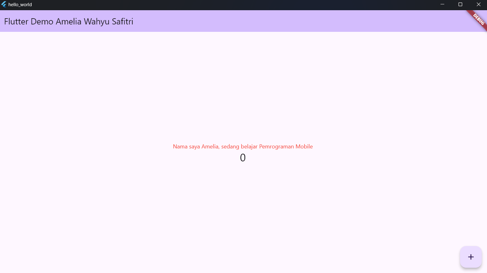
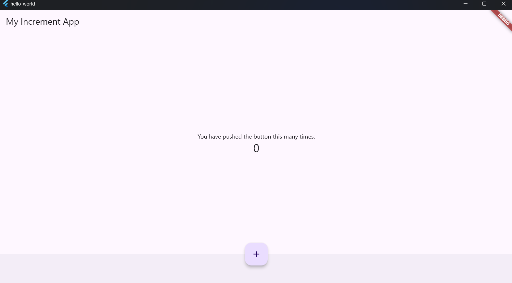

NAMA : AMELIA WAHYU SAFITRI

KELAS : SIB-3D

NIM : 2241760008

***

<H1> JOBSHEET 5

## Praktikum 1
Tampilan hasil file flutter saat pertama kali dijalankan

## Praktikum 2
Menjalankan android studio

barcode untuk menghubungkan antara emulator andorid dengan flutter secara wireless melalui jaringan wifi

Pair berhasil dilakukan sehingga perangkat andorid tidak perlu menggunakan USB

## Praktikum 3
Membuat repository baru dengan nama flutter_fundamental_part1

Tampilan ketik arepository berhasil dibuat.

Melakukan push dengan git init

File berhasil di push ke dalam github

## Praktikum 4
Tampilan widget awal

Tampilan widget dengan nama pribadi saya

Kode program untuk text pada widget

Tampilan setelah text widget diubah

Kode untuk emnampilkan gambar ketika dijalankan

Tampilan setelah dijalankan akan memunculkan gambar

## Praktikum 5

Tampilan Scaffold widget. Scaffold widget digunakan untuk mengatur tata letak sesuai dengan material design.

Tampilan dialog widget, di sini yang memuat dialognya adalah 'show alert' yang berada di  pojok kiri atas

Isi dari dialog show alert

Kode untuk input dan selection widget

Tampilan ketika kode program dijalankan

TextField "nama" bisa diisi dengan text. Di sini say mengisi dengan nama saya

Tampilan Date and Time pickers

Tampilan ketika pilih tanggal diklik. Di sini bisa mengganti tamnggal sesuai dengan kebutuhan

Tampilan ketika saya mencoba untuk mengganti tanggal yang awalnya tanggal 8 Oktober saya ganti menjadi 16 Oktober

